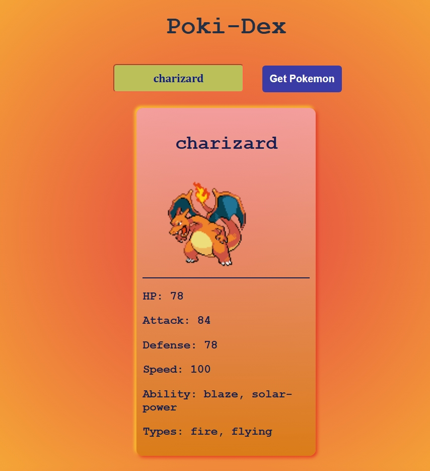
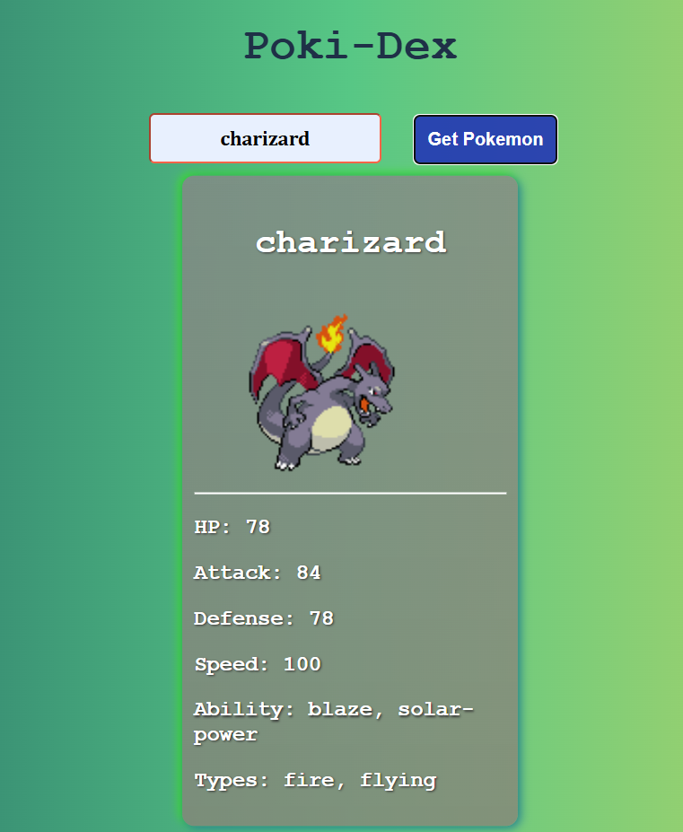

# PokiDex

**PokiDex** is a simple web application that allows users to search for Pokémon by name and retrieve detailed information displayed in a card format. Built using **HTML**, **CSS**, and **JavaScript**, it leverages the [PokéAPI](https://pokeapi.co/) to fetch real-time data.

---

## 🌐 Live Demo

🔗 [View PokiDex Online](https://nikhil-karoriya.github.io/PokiDex/)

---

## 📸 Preview

_A preview of the PokiDex application interface._  

## 🚀 Features
  🔍 Search Functionality
  : Input a Pokémon's name to retrieve its information.
  
  🃏 Information Card
  : Displays the Pokémon's image, name, ID, type, and abilities in a styled card.
  
  🎨 Responsive Design
  : Ensures optimal viewing across various devices.

## 🛠️ Technologies Used
  HTML5 – Structure of the web pages
  
  CSS3 – Styling and layout
  
  JavaScript (ES6) – Functionality and API interactions
  
  PokéAPI – Source of Pokémon data

